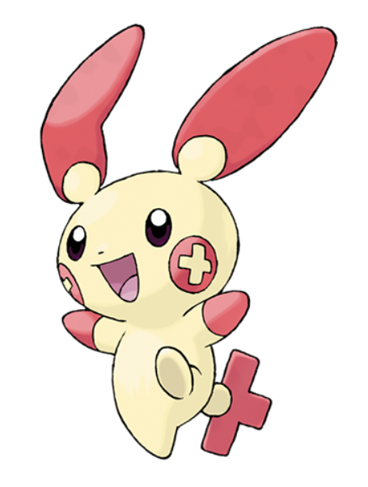
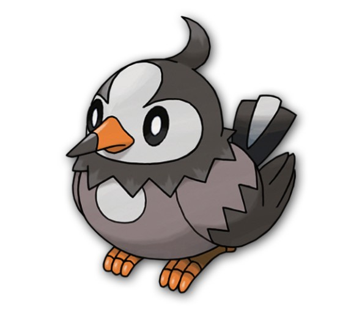
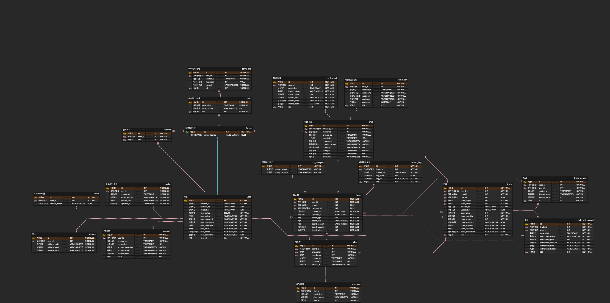
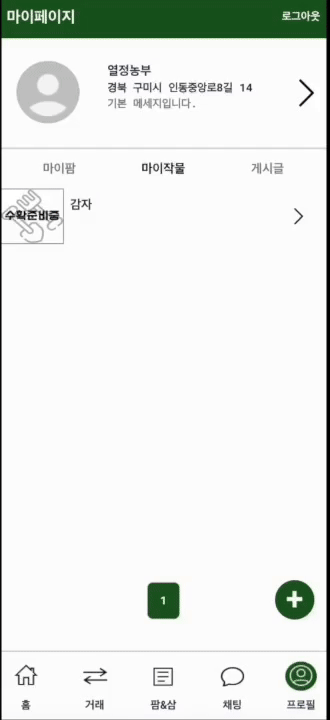

# 🥕 FarmYo 🥕

## 목차

[1. 개요](#🌽-개요)
 
[2. 팀소개](#🍅-팀소개)
 
[3. 개발환경](#🫛-개발환경)
 
[4. ERD](#🥔-erd)
 
[5. 서비스 아키텍처](#🍠-서비스-아키텍처)
 
[6. 주요기능](#🥒-주요-기능)
 
[7. 서비스화면](#🥦-서비스-화면)

## 🌽 개요

**팜요(FarmYo)** 는 블록체인을 활용한 농산물 거래 플랫폼으로, 주로 초보 귀농 농부들이 거래처를 확보하는 데 도움을 주고, 농산물을 활용한 소상공인들이 안전하고 투명한 먹거리 공급처를 확보할 수 있도록 지원합니다. 이를 통해 농산물 시장의 투명성과 안전성을 높이고, 농부와 소상공인 간의 거래를 원활하게 합니다.

### 대상

- 새로운 판매 채널 확보와 경쟁력 있는 브랜드 이미지 구축에 어려움을 겪고 있는 귀농 농부
- 원산지의 품질에 대한 불투명성으로 인한 안정성 우려와 가격 불안정에 대한 불만이 있는 소상공인

### 목표

- 농부의 거래처 확보를 도움으로써 안정적인 귀농 생활 정착
- 소상공인이 투명성과 안전성이 보장된 블록체인을 통한 농산물의 생산과정을 통해 질 높은 농산물 구매 및 활용

 

## 🍅 팀소개

### Frontend

|                           이정민                            |                           장세정                           |
| :---------------------------------------------------------: | :--------------------------------------------------------: |
|  |  |
|         [@minimimin](https://github.com/minimimin)          |        [@wkdtpwjd](https://github.com/wkdtpwjd)        |
|                       메인페이지, 회원   게시판, 채팅   발표자                     |                       프로젝트 구조 구성   거래, 작물, 마이팜                         |

### Backend

|                       김준엽                        |                        권현준                         |                       오승현                       |                      조현제                      |
| :-------------------------------------------------------: | :---------------------------------------------------------: | :--------------------------------------------------------: | :--------------------------------------------------------: |
|  |  |  |  |
|      [@junyeop1322](https://github.com/junyeop1322)       |       [@Kwonhyunjun](https://github.com/Kwonhyunjun)        |           [@timber3](https://github.com/timber3)           |           [@zziru95](https://github.com/zziru95)           |
|                        팀장   거래, 마이팜   이미지 업로드, 조회 (AWS S3)            |                           서기   회원 API   (with JWT)    스프링 시큐리티                           |                 인프라 구축    실시간 채팅 구현                   |                    블록체인  (Solidity, FE, BE)   엔티티 설계   게시물 & 작물 API                  |

 

## 🫛 개발환경

### Frontend

### Backend

### Infra

### Blockchain

### Others

 

## 🥔 ERD

 

## 🍠 서비스 아키텍처

 

## 🥒 주요 기능

### 농산물 블록체인 기록

- 생산과정을 블록체인에 담아 투명성과 안전성이 보장된 농산물 생산 과정 기록
- 파종일, 농약 정보 및 사용일, 수확일, 수상정보, 인증 및 검사 정보 등을 블록체인에 기록
- 구매자는 농사 경력이 아닌 블록체인에 저장된 생애 정보를 통해 구매할 농산물을 선택함

### 스마트 컨트랙트 & 블록체인 기록 

- 판매자와 구매자가 거래를 결정했을때 구매자가 먼저 입금을 하면 판매자가 농산물을 배송함
- 온라인 거래 시 구매자의 안전 거래를 보장해 줌
- 배송이 완료되고 구매자가 농산물을 확인하고 이상이 없는 것을 알리면 판매자에게 송금이 진행되고 거래가 완료됨

### 마이팜

- 판매자들이 자신의 상품을 게시글로 작성할 수 있음
- 구매자들이 판매자의 글을 보고 블록체인으로 제공하는 정보 외에 추가적으로 판매자가 따로 홍보 및 강조하고 싶은 장점을 확인하고 농산물을 구매할 수 있음

 

## 🥦 서비스 화면
### 로그인 및 회원가입

### 작물등록

### 마이팜 및 즐겨찾기

### 거래

### 채팅 거래

